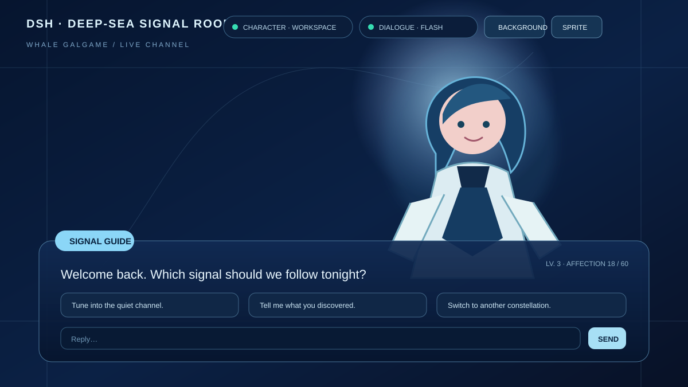
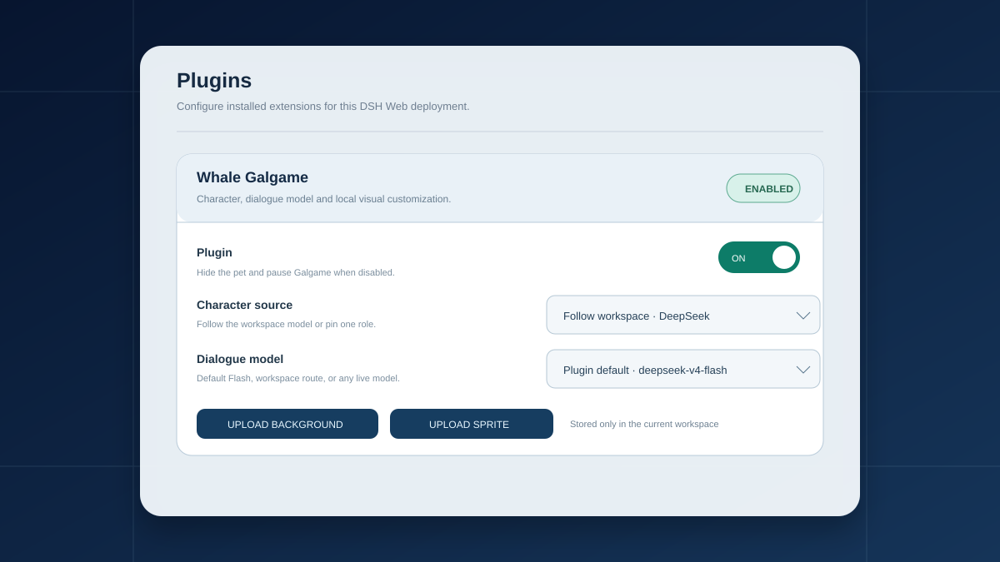
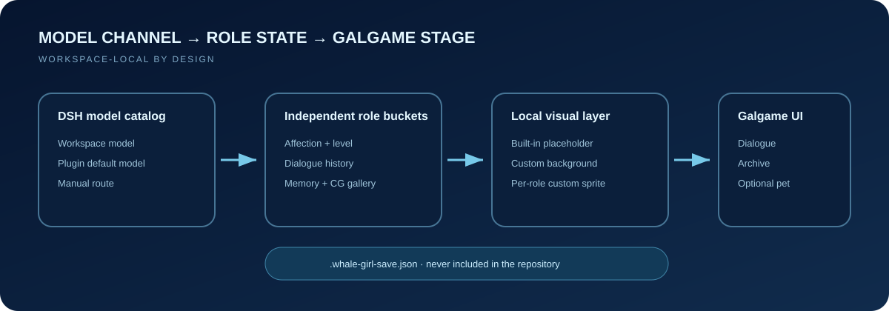

# dsh-whale-galgame

  

[简体中文](README.md) · **English** · [日本語](README.ja.md) · [한국어](README.ko.md)

A multi-character Galgame interface and optional desktop companion for DeepSeek Harness Web. Character source, dialogue model, background, and per-role sprite can all be changed independently.



> This is an unofficial community plugin. The public distribution uses privacy-safe neutral placeholders and contains no maintainer game save, dialogue history, private CG, uploaded image, or local source-art collection.

## Highlights

- **Six independent characters**: DeepSeek, Claude, GPT, Gemini, Kimi, and Grok keep separate affection, levels, memory, dialogue history, and CG galleries.
- **Character/model separation**: follow the workspace model or pin a role; use the plugin Flash default, the workspace route, or any model currently exposed by DSH for dialogue.
- **Local visual customization**: upload a Galgame-only background and a separate custom sprite for each character directly from the top bar.
- **Galgame systems**: varied response choices, affection and levels, dialogue archive, CG gallery, and optional level-up commemorative CGs.
- **Optional desktop pet**: clicking it opens the native Galgame tab when possible; disable it whenever another floating plugin conflicts.
- **Native settings card**: enable the plugin and select character/dialogue defaults under Settings → Plugins → Plugin configuration.



## Quick install

### Requirements

- DeepSeek Harness with the `dsh` command available.
- The DSH Web profile.

### Install from GitHub

```sh
dsh plugin --profile web add github:JAdpp/dsh-whale-galgame#main
```

Restart the Web profile after installation. A `galgame` tab should appear in every conversation.

```sh
dsh --profile web
```

When running Harness from a source checkout, replace `dsh` with the matching `pnpm dsh` command used by your setup.

### Update and remove

```sh
dsh plugin --profile web update @dsh-external/dsh-whale-galgame
dsh plugin --profile web remove @dsh-external/dsh-whale-galgame
```

Restart the Web profile after either operation.

## Configuration

### Top-bar controls

- **Character source** — follow the workspace or pin one model-character.
- **Actual dialogue** — use the plugin default, the workspace route, or another live model.
- **Background** — preview, apply, replace, or restore a Galgame-only background.
- **Character sprite** — upload a sprite for the current role or restore its placeholder.

PNG, JPEG, WebP, and AVIF are supported up to 12 MB in the browser. Files are written only to the current workspace save and are never uploaded to this repository.

### Optional level-up CGs

Without a DashScope key, chat, role switching, history, affection, and custom visuals still work; only CG generation is unavailable. To enable it, set the key in the local DSH process environment:

```powershell
$env:DASHSCOPE_API_KEY = 'your-local-key'
dsh --profile web
```

```sh
DASHSCOPE_API_KEY='your-local-key' dsh --profile web
```

You may instead edit the installed local `cordis.patch.yml`, but never commit a real key. The repository version intentionally stays empty.

## Data and privacy



Runtime state lives in `.whale-girl-save.json` at the active workspace root. It may contain character state, dialogue history, CGs, and user-uploaded backgrounds or sprites. It is not plugin source and is explicitly ignored by Git.

- Normal view polling returns metadata only; large images are fetched on demand.
- Custom sprites are isolated per role; the background belongs to the workspace.
- Disabling the plugin pauses Galgame chat and affection settlement while leaving the settings card available.
- Public documentation and builds never use a real user's history.

## Development

```sh
npm ci
npm run prune:art
npm run verify
```

`lib/index.js` and `lib/client.js` are committed so GitHub installation needs no local build. Rebuild and commit both bundles after editing `src/`.

## Repository layout

```text
build/                         DSH Web client bundling adapters
docs/                          privacy-safe README vector mockups
lib/                           installable host and client bundles
scripts/prune-art.mjs          removes unreferenced embedded art
src/index.ts                   state, model routing, saves, CGs, local API
src/client/index.ts            Galgame, pet, settings, and upload UI
src/client/art.generated.ts    neutral public placeholder visuals
cordis.patch.yml               key-free default DSH bundle config
```

## License and acknowledgements

Software, documentation, and neutral public placeholder art are MIT licensed. See [LICENSE.md](LICENSE.md) and [NOTICE.md](NOTICE.md).

Creative and technical lineage: 上善, ZipZipPipe, [Small-tailqwq / dsh-deep-whale](https://github.com/Small-tailqwq/dsh-deep-whale), and [@linxin666/dsh-pet in dsh-web-ui](https://github.com/zhu1090093659/dsh-web-ui). The public package does not redistribute their original images. Follow the applicable license and full attribution chain when adding third-party art locally.

DeepSeek, Claude, ChatGPT/GPT, Gemini, Kimi, Grok, and related marks belong to their respective owners. This project is not affiliated with or endorsed by them.
