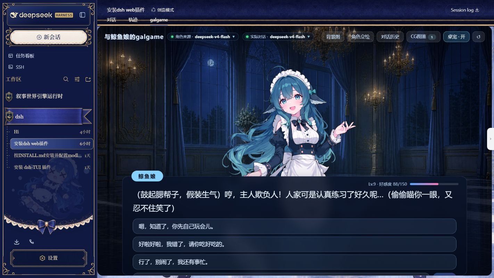
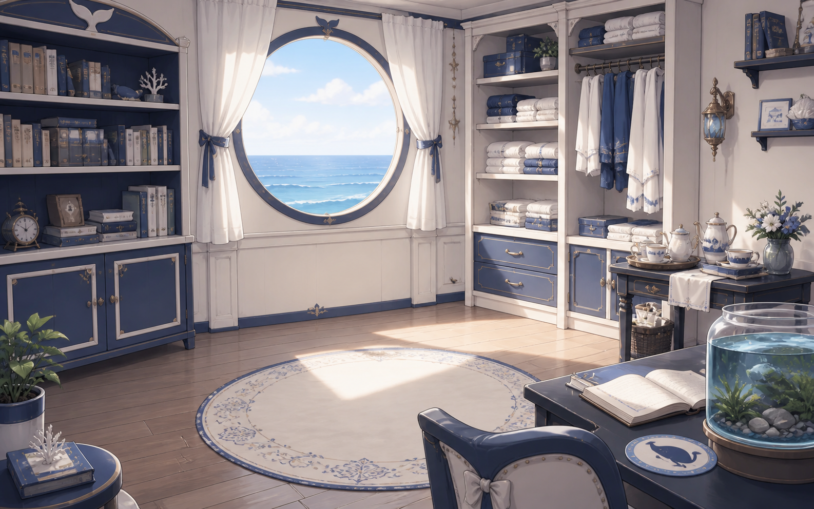
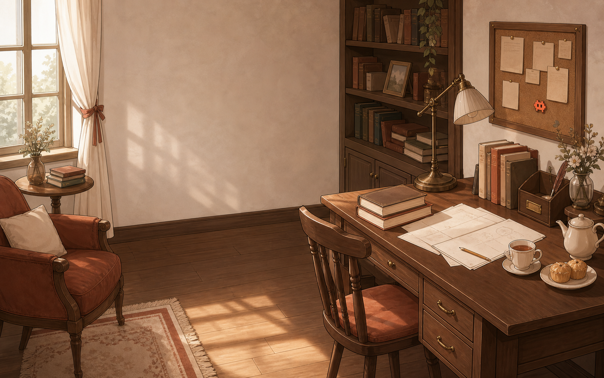
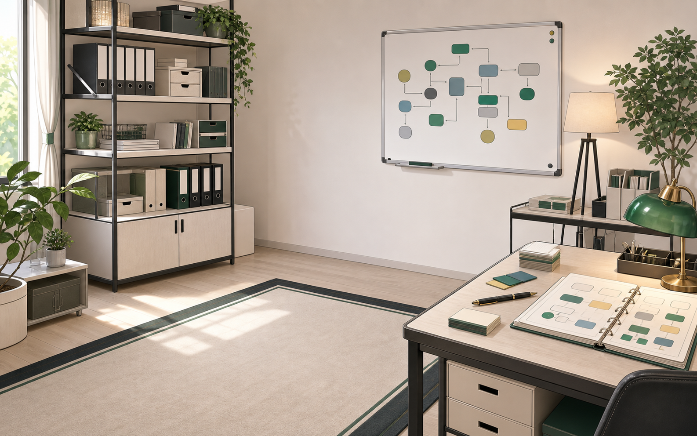
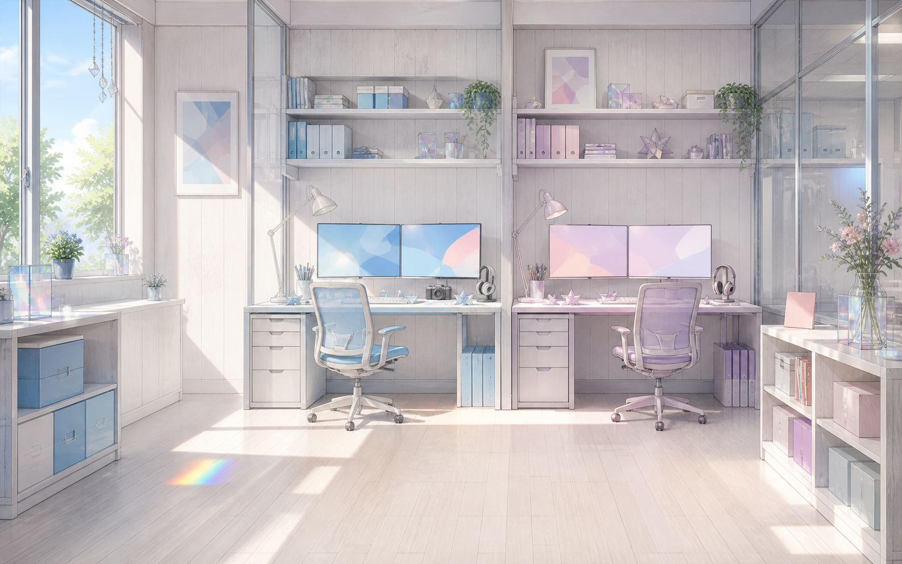
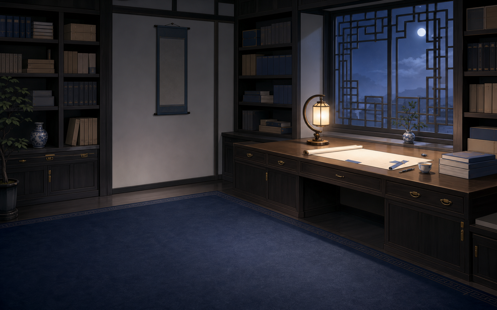
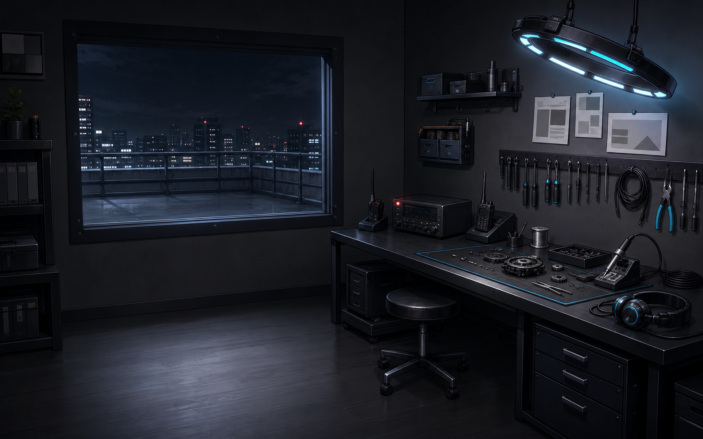

# dsh-whale-galgame · A multi-character Galgame engine aware of cross-session task events

[简体中文](README.md) · **English** · [日本語](README.ja.md) · [한국어](README.ko.md)

Recent Harness work can shape what a character says next.

`dsh-whale-galgame` adds a dedicated multi-character Galgame view to DeepSeek Harness Web. Local deterministic rules classify recent same-workspace activity into 11 task categories, including debugging, writing, and research. When you chat in the Galgame, the current character can naturally acknowledge that work. Raw Harness task text stays in the local classification step; the reply model receives only fixed category and status cues, while tool arguments, tool results, and assistant message bodies are excluded from this awareness path.

DeepSeek, Claude, GPT, Gemini, Kimi, and Grok map to six independent roles. The displayed role is selected separately from the model that writes replies, and each role keeps its own relationship progress, recent dialogue context, dialogue archive, task-event mention state, CGs, custom sprite, and built-in background selection. Affection responds to three shuffled reply types, newly observed Harness token usage while the plugin is running, and long absences; levels have no cap. With a DashScope key, level-ups can generate 1920 × 1080 landscape CGs themed to recent work. The desktop pet can be disabled and opens the Galgame view when clicked.

> The plugin interface is currently in Simplified Chinese. This page translates the installation and usage documentation.

## What it does

- Choose the displayed character separately from the reply model. A role can follow the workspace model or be pinned; replies can use the default `deepseek-v4-flash`, follow the workspace, or use a model listed by DSH.
- The six roles keep separate affection, level, memory, dialogue history, CG gallery, and custom-sprite data.
- Each turn offers close, neutral, and distant reply options in shuffled positions. Free-text input remains available.
- Switching roles also switches to that role's built-in background. The whale-girl still defaults to the deep-sea palace; her new seaside study is an optional built-in alternative. A user upload or saved CG overrides role defaults until a built-in background is restored.
- Manage the background, per-role sprite, dialogue archive, CG gallery, and desktop pet from the interface. Clicking the pet opens the `galgame` tab.

## Affection and cross-session context

### Relationship progression

Each role begins at Lv.1 with 0 affection and keeps its own state. The close, neutral, and distant reply choices apply +1, 0, and -1 respectively, with their positions shuffled each turn; free text uses lightweight keyword rules. While the plugin is running, every 5,000 input and output tokens observed in newly emitted same-workspace Harness `assistant/message` usage events add 1 point to the current role. A settlement redeems at most 3 points and keeps the remaining balance; model calls initiated by the plugin itself are excluded, and historical usage is not recalculated. After a 24-hour grace period without activity, every role loses 2 points per day, with a floor of 0.

The level threshold is `30 + 15 × (Lv - 1)`: 30, 45, 60, and so on. Reaching it raises the level and carries any surplus into the next one; there is no level cap. Relationship tone has five stages and remains at the closest stage from Lv.5 onward. With a valid DashScope key configured, each level-up attempts to generate a commemorative CG.

### Harness task events

The plugin examines at most 16 top-level live and persisted Harness sessions from the same workspace, limited to the past 72 hours and the final 240 events in each session. Local deterministic rules classify activity as code debugging, code development, document summarization, document writing, literary creation, research, data analysis, visual design, presentation work, translation and proofreading, or task planning. Text classification uses only explicit user text submitted by a person; tool names and turn-end status may also contribute. Tool arguments, tool results, and assistant body text are neither read nor sent.

Only fixed category and status cues are passed to the Galgame reply model and CG generation service. While answering the current topic, the character naturally adds one brief acknowledgement—for example, reminding the player to rest after a debugging task. Each role stores its own event fingerprints and last-mention time: an event is proactively mentioned only once to that role, with at least 30 minutes between different events. Task events affect the topic, not affection directly.

## Bundled default art

The installed plugin embeds 22 runtime visual assets: six character sprites, seven built-in backgrounds, eight whale-girl expressions, and one 11-row desktop-pet animation atlas from [dsh-deepseek-girl-pet](https://github.com/f0909172434/dsh-deepseek-girl-pet). The six images below are the default role sprites; [`assets/default/`](assets/default/README.md) lists every exported file and its runtime purpose. The npm installation carries only the client bundle with embedded art, rather than duplicating the raw exports or generated-art source.

<table>
  <tr>
    <td align="center"> <strong>DeepSeek · Whale Girl</strong></td>
    <td align="center"> <strong>Claude · 克洛德</strong></td>
    <td align="center"> <strong>GPT · 小吉</strong></td>
  </tr>
  <tr>
    <td align="center"> <strong>Gemini · 双子</strong></td>
    <td align="center"> <strong>Kimi · 月见</strong></td>
    <td align="center"> <strong>Grok · 洛可</strong></td>
  </tr>
</table>

The six new role backgrounds are shown below. Claude, GPT, Gemini, Kimi, and Grok use their matching scene by default. DeepSeek keeps `palace-night.webp` as the whale-girl default; the seaside study shown here is a selectable built-in alternative.

<table>
  <tr>
    <td align="center"> <strong>DeepSeek · optional</strong></td>
    <td align="center"> <strong>Claude</strong></td>
    <td align="center"> <strong>GPT</strong></td>
  </tr>
  <tr>
    <td align="center"> <strong>Gemini</strong></td>
    <td align="center"> <strong>Kimi</strong></td>
    <td align="center"> <strong>Grok</strong></td>
  </tr>
</table>

The remaining runtime assets comprise eight full-resolution transparent `whale-*.png` expression images and the 8-column × 11-row `pet-spritesheet.webp` animation atlas. The first 21 default images and the pet atlas use different licenses; see the [NOTICE](NOTICE.md) and [third-party license index](THIRD_PARTY_LICENSES.md) for sources, modifications, and file-by-file licensing.

The Galgame layout, dialogue box, controls, and decorations are public in [`src/client/index.ts`](src/client/index.ts); there is no undisclosed UI-image pack.

## Install

DeepSeek Harness must be installed with a working `dsh` command and Web profile.

~~~sh
dsh plugin --profile web add github:JAdpp/dsh-whale-galgame#main
~~~

After installation, stop the running Web profile and start it again:

~~~sh
dsh --profile web
~~~

If a source installation exposes the command as `pnpm dsh`, keep the same arguments.

### Update and remove

~~~sh
dsh plugin --profile web update @dsh-external/dsh-whale-galgame
dsh plugin --profile web remove @dsh-external/dsh-whale-galgame
~~~

Stop and restart the Web profile after either operation.

## Use and settings

The Galgame top bar controls the displayed character and actual dialogue model. It also accepts a background or a sprite for the current role. PNG, JPEG, WebP, and AVIF are supported, with a 12 MB browser-side limit per file.

Settings → Plugins → Plugin configuration contains the plugin toggle and the default character and reply-model choices. Disabling the plugin pauses Galgame dialogue and affection settlement without deleting existing data.

## Optional generated CGs

Level-up CGs use DashScope `qwen-image-3.0` at 1920 × 1080 by default. Without a DashScope key, chat, role switching, history, affection, and custom images still work; only CG generation is unavailable.

Provide the key only through the local environment that starts DSH:

~~~powershell
$env:DASHSCOPE_API_KEY = 'your-local-key'
dsh --profile web
~~~

~~~sh
DASHSCOPE_API_KEY='your-local-key' dsh --profile web
~~~

Do not write a real key into repository files or commit one to Git.

## Data and privacy

Runtime data is stored in `.whale-girl-save.json` at the active workspace root. It may contain role state, dialogue history, CGs, user backgrounds, and user sprites, so treat it as private data.

- Ordinary dialogue is sent to the model provider selected in DSH.
- Generating a level-up CG sends a text prompt to DashScope.
- User-uploaded backgrounds and sprites remain in the workspace save and are not included in either external request.
- Harness context writes only event fingerprints that contain no source text and the last-mention time to the save; it does not store the original Harness text. External requests receive only fixed category and status cues.
- If the active session and the plugin save do not belong to the same workspace, the Galgame view refuses to read role state or task cues instead of reusing data across workspaces.

This plugin repository's `.gitignore` cannot protect a different workspace automatically. If the active workspace is itself a Git repository, add these entries to that workspace's `.gitignore`:

~~~gitignore
.whale-girl-save.json
.whale-girl-save.*.json
~~~

## Development

~~~sh
npm ci
npm run sanitize:backgrounds
npm run embed:art
npm run export:art
npm run verify
~~~

The repository commits installable `lib/index.js` and `lib/client.js` bundles. Rebuild and commit both after changing `src/`. `npm run sanitize:backgrounds` strips non-visual PNG metadata from the six role backgrounds, `npm run embed:art` writes the allowlisted files into the runtime source, and `npm run export:art` reproduces all 22 public assets for byte-level checking.

## License and credits

Code, the Galgame UI implementation, and documentation are covered by the [MIT License](LICENSE.md). The six character sprites, seven built-in backgrounds, and eight whale-girl expressions—21 default images in total—are distributed under [CC BY-NC-SA 4.0](https://creativecommons.org/licenses/by-nc-sa/4.0/); project-produced AI-assisted images are offered under that license only to the extent the maintainer holds the applicable rights. The `pet-spritesheet.webp` atlas and code directly inherited from [dsh-deepseek-girl-pet](https://github.com/f0909172434/dsh-deepseek-girl-pet) retain its MIT license. See the file-by-file [NOTICE](NOTICE.md) and preserved upstream texts in [`assets/default/licenses/`](assets/default/licenses/).

Finally, thank you to the people who made specific artwork and implementation knowledge available to the community:

- **上善** created the original whale-girl character: [Pixiv](https://www.pixiv.net/users/62155430) · [Bilibili](https://space.bilibili.com/4456176).
- **ZipZipPipe** added DeepSeek elements to that character in the maid whale-girl redesign: [Pixiv](https://www.pixiv.net/users/18604994) · [Bilibili](https://space.bilibili.com/4168597).
- **Small-tailqwq** published the deep-sea palace background, whale-girl standing sprite, and Galgame UI decorations reused here in [dsh-deep-whale](https://github.com/Small-tailqwq/dsh-deep-whale), together with the full attribution chain. This project built eight additional expression images from that material.
- **f0909172434 / [dsh-deepseek-girl-pet](https://github.com/f0909172434/dsh-deepseek-girl-pet)** released the DSH whale-girl desktop pet under MIT. This plugin's pet feature is a derivative of that project, and its `pet-spritesheet.webp` is identical to the upstream atlas. This project changed the plugin integration and visual styling and added the click-to-open-Galgame interaction.
- The Claude-, GPT-, Gemini-, Kimi-, and Grok-inspired sprites, six daily-life role backgrounds, and the Galgame UI are unofficial, AI-assisted project artwork. They are not official character designs, partnerships, or endorsements from the named companies.

If these open-source materials and implementations help you, consider starring [dsh-deep-whale](https://github.com/Small-tailqwq/dsh-deep-whale) and [dsh-deepseek-girl-pet](https://github.com/f0909172434/dsh-deepseek-girl-pet), or following 上善 and ZipZipPipe on Pixiv or Bilibili. Please report installation, runtime, or compatibility problems to [this repository's Issues](https://github.com/JAdpp/dsh-whale-galgame/issues) rather than asking the artists to troubleshoot plugin code.

DeepSeek, Claude, ChatGPT/GPT, Gemini, Kimi, Grok, and related marks belong to their respective owners. This is an unofficial community plugin and is not affiliated with, partnered with, or endorsed by those owners.

## Related projects

- [gal-view](https://github.com/Ayase34/gal-view)
- [dsh-galgame](https://github.com/Lanxing6480/dsh-galgame)
- Recommended desktop pet: [dsh-deepseek-girl-pet](https://github.com/f0909172434/dsh-deepseek-girl-pet)

If you enjoy these projects, consider giving their repositories a Star.
