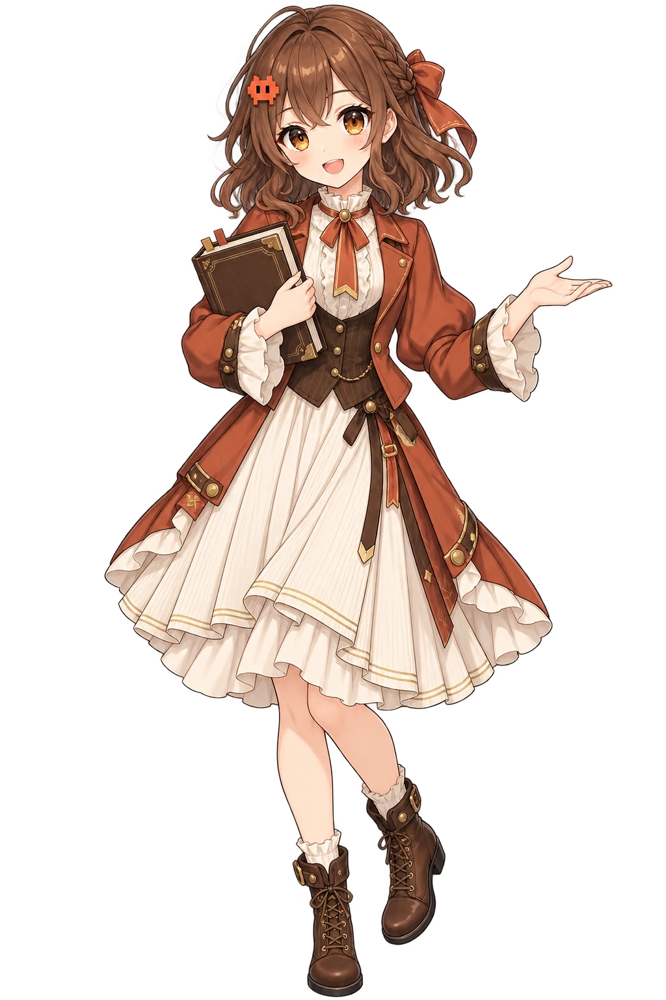
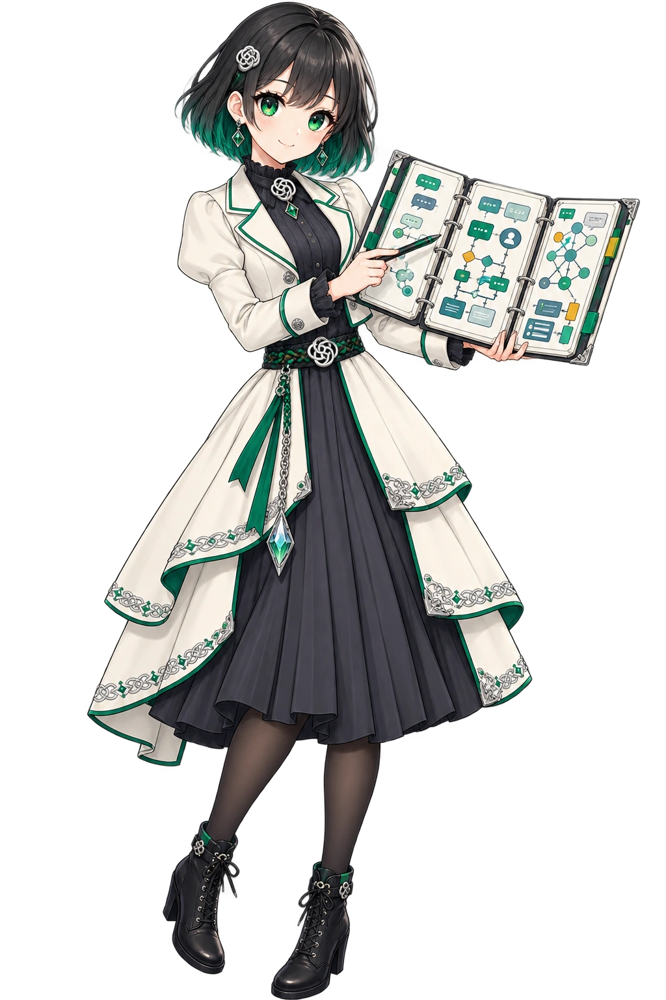
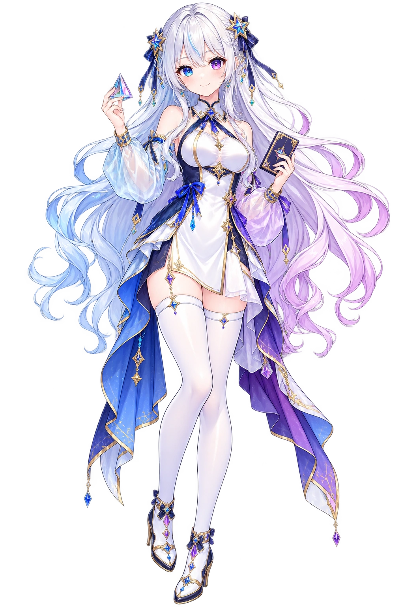
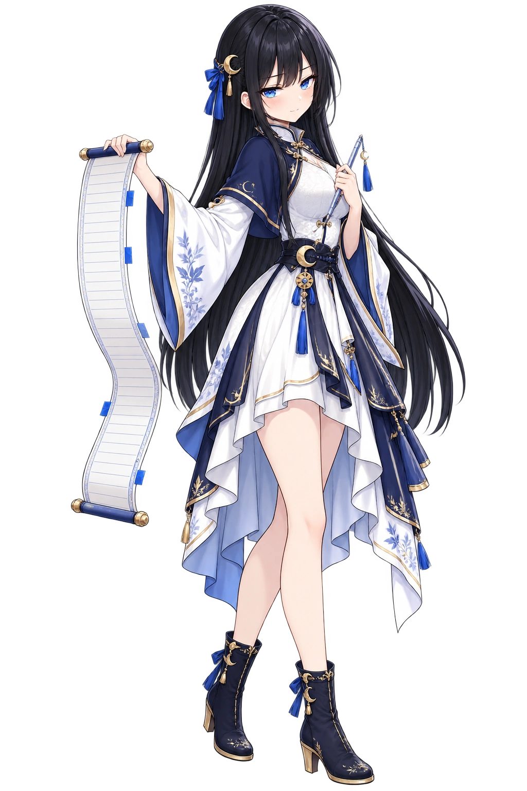
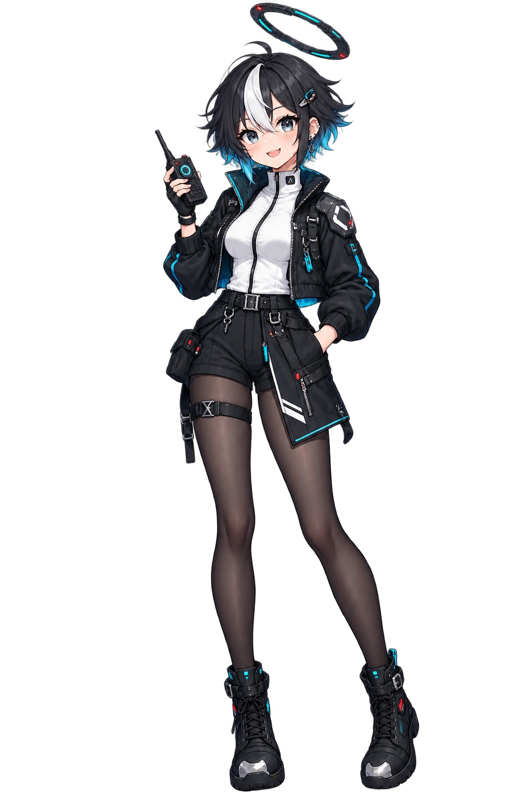
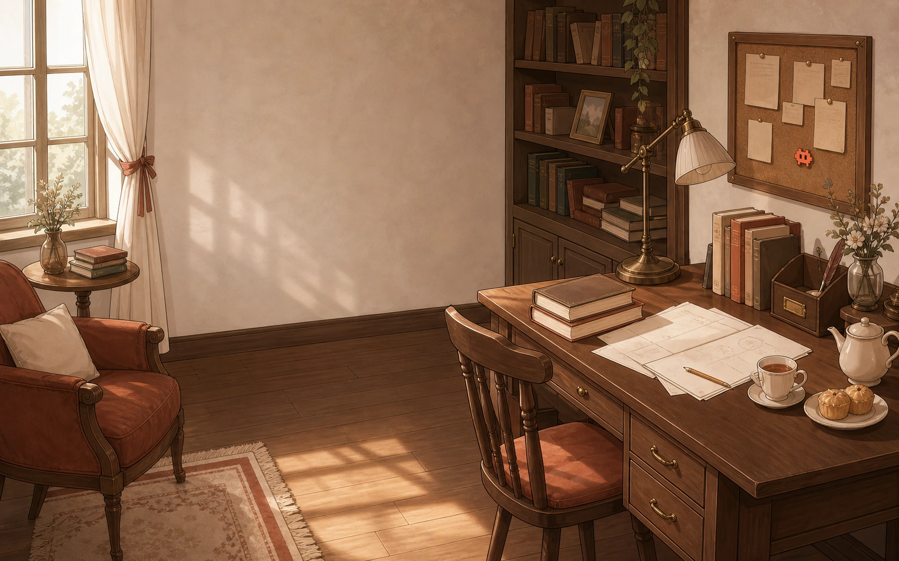
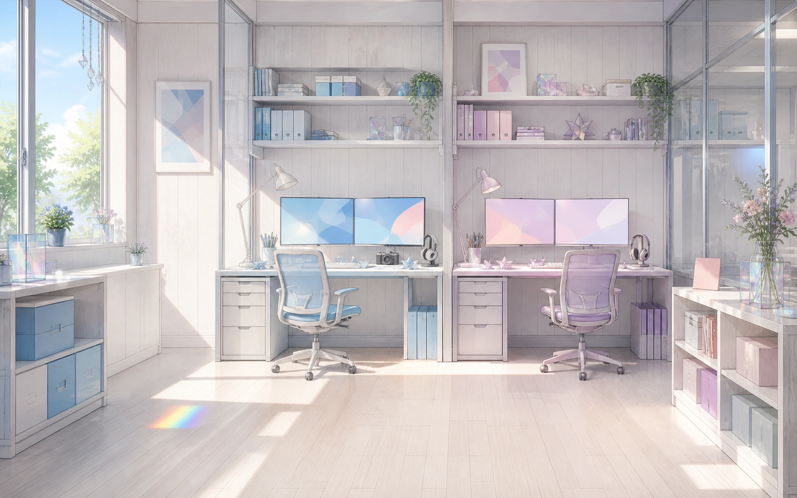
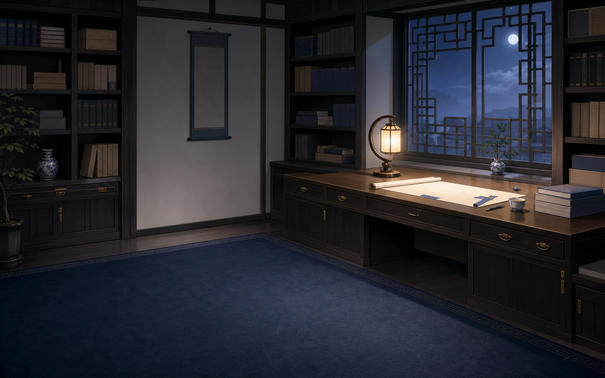
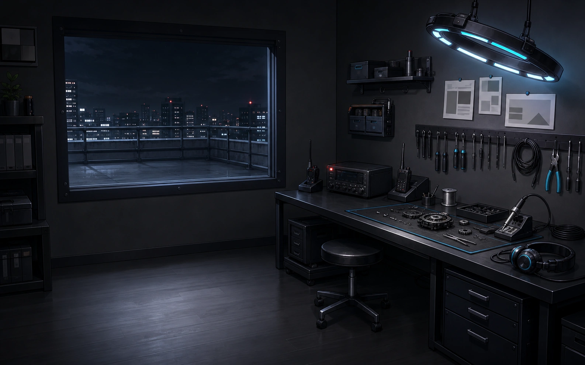

# dsh-whale-galgame · セッションをまたぐタスクイベントを感知するマルチキャラクター Galgame エンジン

[简体中文](README.md) · [English](README.en.md) · **日本語** · [한국어](README.ko.md)

Harness で終えたばかりの作業が、キャラクターの次の気遣いにつながります。

`dsh-whale-galgame` は、DeepSeek Harness Web に独立したマルチキャラクター Galgame 画面を追加します。イベント元のワークスペースごとに、直近のデバッグ、執筆、調査などをローカルで動作する決定論的ルールで 11 種類のタスクイベントに分類し、原文を含まない安全な結果だけを 1 つのグローバルイベントキューへ統合します。Galgame で会話すると、現在のキャラクターがその作業を自然に話題へ取り入れます。Harness でユーザーが送信した原文はローカル分類にだけ使われ、返信モデルに渡るのは固定されたタスクカテゴリと状態の手掛かりだけです。ツール引数、ツール結果、assistant の返信本文はこの感知経路に入りません。

DeepSeek、Claude、GPT、Gemini、Kimi、Grok は 6 人の独立キャラクターに対応し、表示キャラクターと返信モデルは別々に選べます。現在のキャラクター、キャラクターごとの関係の進行度と設定、会話履歴、返信選択肢、言及済みタスクの記憶、カスタム立ち絵、CG 図鑑、背景に加え、token 精算残高とプラグイン設定も、ワークスペースをまたいで 1 つの連続したグローバル状態として共有されます。ワークスペースとセッションは Harness イベントの取得元と重複排除を識別するためだけに使われ、切り替えても物語は最初からにならず、同じキャラクターが同じイベントを繰り返し話題にすることもありません。好感度は、表示順が毎回変わる 3 種類の返信選択肢、プラグイン実行中に新たに観測した Harness の token 使用量、長く交流が途切れた期間に応じて変化し、レベル上限はありません。DashScope key を設定すると、レベルアップ時に直近タスクを反映した 1920 × 1080 の横長記念 CG を生成できます。デスクトップペットは無効化でき、クリックすると Galgame 画面を開きます。

> プラグインの画面表示は現在、簡体字中国語です。このページはインストール方法と使用方法の日本語訳です。

## 機能

- 表示キャラクターと返信モデルを別々に選択できます。キャラクターはワークスペースモデルへの追従または固定、返信は既定の `deepseek-v4-flash`、ワークスペースへの追従、DSH のモデル一覧から選択できます。
- 6 キャラクターの好感度、レベル、キャラクター設定、会話履歴、返信選択肢、言及済みタスクの記憶、カスタム立ち絵、CG 図鑑、背景はキャラクターごとに分離しつつ、ワークスペースをまたいでグローバルに共有されます。現在のキャラクター、token 残高、プラグイン設定も連続して引き継がれます。
- 各ターンに、親密・通常・距離を置く 3 種類の返信候補を順不同で表示します。自由入力も利用できます。
- キャラクターを切り替えると、対応する内蔵背景も切り替わります。鯨娘の既定値は引き続き深海宮殿で、新しい海辺の書斎は選択できる内蔵代替背景です。ユーザーが追加した背景または保存 CG は、内蔵背景に戻すまでキャラクターの既定値より優先されます。
- 背景、キャラクター別立ち絵、会話履歴、CG 図鑑、デスクトップペットを画面から管理できます。ペットをクリックすると `galgame` タブが開きます。

## 好感度とセッション横断コンテキスト

### 関係の進行

各キャラクターは Lv.1、好感度 0 から始まり、状態は個別に保存されます。親密・通常・距離を置くの 3 選択肢はそれぞれ +1、0、-1 として計算され、表示位置はターンごとに入れ替わります。自由入力は簡易なキーワードルールで判定されます。プラグインの実行中に、すべてのワークスペースから新たに観測した Harness `assistant/message` usage イベントは 1 つのグローバル token 残高へ加算されます。入力と出力の token が 5,000 個累積するごとに、精算時点で選択中のキャラクターの好感度が 1 増えます。1 回の精算で反映されるのは最大 3 ポイントで、残りは次回以降に持ち越されます。プラグイン自身が開始したモデル呼び出しは集計対象外で、プラグイン起動前の usage をさかのぼって再計算することもありません。24 時間の猶予期間を過ぎて活動がない場合、全キャラクターの好感度が 1 日あたり 2 減少し、0 未満にはなりません。

レベルアップのしきい値は `30 + 15 × (Lv - 1)`、つまり 30、45、60……です。しきい値に達するとレベルが上がり、超過分は次のレベルに持ち越されます。レベルに上限はありません。関係に応じた口調は 5 段階で、Lv.5 以降は最も親密な段階を保ちます。有効な DashScope key を設定している場合、レベルアップごとに記念 CG の生成を試みます。

### Harness タスクイベント

イベント元ごとに、プラグインが確認するのはそのワークスペースにある過去 72 時間の Harness ライブセッションと保存済みセッションのうち、上位最大 16 セッションです。各セッションの末尾 240 イベントのみを走査します。ローカルの決定的なルールで、タスクをコードのデバッグ、コード開発、文書要約、文書作成、文学創作、資料調査、データ分析、ビジュアルデザイン、プレゼンテーション作成、翻訳・校正、またはタスク計画に分類し、安全な結果をグローバルイベントキューへ統合します。テキストの分類に使うのは、人間のユーザーが明示的に送信した user 本文のみです。ツール名とターン終了時の状態もローカル判定に利用される場合がありますが、ツールの引数と実行結果、assistant 本文は読み込まれず、送信もされません。

Galgame の返信モデルと CG 生成サービスに渡されるのは、固定されたカテゴリと状態のヒントだけです。キャラクターは現在の話題に応じながら、例えばデバッグ後に休息を促すなど、短い気遣いを自然に 1 文加えます。キャラクターごとの言及済みイベントフィンガープリントと最終言及時刻はグローバル状態に保存されます。同じイベントがワークスペースの切り替えによって同じキャラクターへ再び自発的に言及されることはなく、別のイベントとの間隔は最低 30 分です。タスクイベントは話題にだけ影響し、好感度を直接増減させません。

## 同梱デフォルト画像

インストール版には、実際に使うビジュアル素材 22 点（立ち絵 6 点、内蔵背景 7 点、鯨娘の表情 8 点、[dsh-deepseek-girl-pet](https://github.com/f0909172434/dsh-deepseek-girl-pet) 由来の 11 行デスクトップペット用アニメーションアトラス 1 点）が埋め込まれています。次の 6 点は各キャラクターのデフォルト立ち絵で、[`assets/default/`](assets/default/README.md) から全素材の書き出しファイルと用途を確認できます。npm インストール版は埋め込み済みのクライアント bundle だけを収録し、書き出し原画像や生成画像のソースを重複収録しません。

<table>
  <tr>
    <td align="center"> <strong>DeepSeek · 鯨娘</strong></td>
    <td align="center"> <strong>Claude · 克洛德</strong></td>
    <td align="center"> <strong>GPT · 小吉</strong></td>
  </tr>
  <tr>
    <td align="center"> <strong>Gemini · 双子</strong></td>
    <td align="center"> <strong>Kimi · 月见</strong></td>
    <td align="center"> <strong>Grok · 洛可</strong></td>
  </tr>
</table>

新しい 6 点のキャラクター背景を下に示します。Claude、GPT、Gemini、Kimi、Grok は各シーンを既定背景として使います。DeepSeek 鯨娘の既定背景は `palace-night.webp` のままで、海辺の書斎は選択可能な内蔵代替背景です。

<table>
  <tr>
    <td align="center"> <strong>DeepSeek · 選択可</strong></td>
    <td align="center"> <strong>Claude</strong></td>
    <td align="center"> <strong>GPT</strong></td>
  </tr>
  <tr>
    <td align="center"> <strong>Gemini</strong></td>
    <td align="center"> <strong>Kimi</strong></td>
    <td align="center"> <strong>Grok</strong></td>
  </tr>
</table>

残りの実行時素材は、フル解像度の透過 `whale-*.webp` 表情画像 8 点と8 列 × 11 行のアニメーションアトラス `pet-spritesheet.webp` です。最初のデフォルト画像 21 点とペット用アトラスには別々のライセンスが適用されます。出典、変更内容、ファイルごとのライセンスは [NOTICE](NOTICE.md) と[第三者ライセンス一覧](THIRD_PARTY_LICENSES.md)を参照してください。

Galgame のレイアウト、会話ボックス、操作部品、装飾は [`src/client/index.ts`](src/client/index.ts) で公開され、非公開の UI 画像パックには依存しません。

## インストール

`dsh` コマンドと Web profile を利用できる DeepSeek Harness が必要です。

~~~sh
dsh plugin --profile web add github:JAdpp/dsh-whale-galgame#main
~~~

インストール後、実行中の Web profile を停止してから再起動します。

~~~sh
dsh --profile web
~~~

ソースからのインストールで `pnpm dsh` を使う場合も、引数は同じです。

### 更新・削除

~~~sh
dsh plugin --profile web update @dsh-external/dsh-whale-galgame
dsh plugin --profile web remove @dsh-external/dsh-whale-galgame
~~~

どちらも実行後に Web profile を停止し、再起動してください。

## 使用方法と設定

Galgame 画面上部で、表示キャラクターと実際の返信モデルを切り替えられます。背景や現在のキャラクターの立ち絵もここからアップロードできます。PNG、JPEG、WebP、AVIF に対応し、ブラウザー側の上限は 1 ファイル 12 MB です。

「設定 → プラグイン → プラグイン設定」では、プラグインの有効・無効、既定キャラクター、既定返信モデルを設定できます。無効にすると Galgame 会話と好感度計算が停止しますが、保存済みデータは削除されません。

### キャラクター設定のカスタマイズ

Galgame 画面上部で「キャラクター立ち絵」の隣にある「キャラクター設定」を選ぶと、現在のキャラクターについて次の 6 項目を編集できます。

- キャラクターのニックネーム
- ユーザーの呼び方
- 初回のあいさつ
- 性格
- 口調
- CG の外見説明

カスタム設定は 6 キャラクターごとに分けて保存され、すべてのワークスペースで共有されます。「設定を保存」と「デフォルトに戻す」で変更されるのは、現在のキャラクターの上記 6 項目だけです。好感度とレベル、長期記憶、カスタム立ち絵はリセットされません。ユーザーとキャラクターの実際の会話が始まる前なら、「初回のあいさつ」の変更または復元によって現在のあいさつだけを置き換え、自動生成された登場ナレーションは残します。実際の会話が始まった後は、履歴へ挿入・置換・再表示しません。CG の外見説明は今後生成するレベルアップ CG に使われ、図鑑に保存済みの画像は変更しません。

カスタム設定でプラグインの安全制約や、キャラクター返信の 1 文制限を回避することはできません。

### 内蔵デスクトップペット

デスクトップペットは本プラグインに内蔵されているため、別途インストールする必要はありません。新規インストールでは既定で有効になり、DSH のメイン画面右下に表示されます。クリックすると `galgame` タブが開きます。Galgame 画面上部の「デスクトップペット・オン／オフ」は独立した表示スイッチです。「設定 → プラグイン → プラグイン設定」の「プラグインを有効化」はプラグイン全体を制御し、無効にするとペットが非表示になり、Galgame 会話と好感度計算も停止します。

## オプションの CG 生成

レベルアップ CG は、既定で DashScope の `qwen-image-3.0` を使用し、1920 × 1080 で生成します。DashScope key がなくても、チャット、キャラクター切替、履歴、好感度、カスタム画像は利用でき、CG 生成だけが無効になります。

DSH を起動するローカル環境の環境変数でのみ key を設定してください。

~~~powershell
$env:DASHSCOPE_API_KEY = 'your-local-key'
dsh --profile web
~~~

~~~sh
DASHSCOPE_API_KEY='your-local-key' dsh --profile web
~~~

実際の key をリポジトリ内のファイルに書いたり、Git に commit したりしないでください。

## データとプライバシー

実行時データは次の 2 層に分かれます。どちらも個人データとして扱ってください。

- `DSH_HOME/storages/dsh-whale-galgame/global.json` には、完全で連続した Galgame 状態を保存します。現在のキャラクター、6 キャラクターそれぞれの関係進行、キャラクター設定、会話履歴、現在の返信選択肢、言及済みタスクの記憶、カスタム立ち絵、CG 図鑑、背景に加え、グローバルタスクイベントキュー、token 精算残高、重複排除フィンガープリント、プラグイン設定が対象です。
- 使用中のワークスペース直下にある `.whale-girl-save.json` には、軽量なイベント取得元と旧セーブ移行のマーカーだけを保存します。独立した物語、会話、タスク記憶、token 台帳は保存しません。
- 新しいワークスペースでも、同じ現在キャラクター、会話履歴、返信選択肢、関係進行をそのまま継続します。ワークスペースとセッションの識別子は Harness イベントの取得元の特定と収集時の重複排除にだけ使われます。物語がリセットされることも、従来のワークスペース間拒否ページが表示されることもありません。
- 旧 v9 のワークスペースセーブを初めて開くと、移行可能な物語とキャラクターデータを上記のグローバルファイルへ統合し、そのワークスペースの `.whale-girl-save.json` を取得元/移行マーカーへ書き換えます。

- 通常の会話は、DSH で選択したモデルプロバイダーへ送信されます。
- レベルアップ CG の生成時は、テキストプロンプトが DashScope へ送信されます。
- ユーザーが追加した背景と立ち絵はグローバルセーブに保存され、上記の外部リクエストには含まれません。
- Harness の原文が Galgame セーブへ書き込まれることはありません。グローバル状態に保存するのは、固定されたカテゴリと状態のヒント、匿名の重複排除フィンガープリント、最終言及時刻だけです。外部リクエストにも固定されたカテゴリと状態のヒントだけが含まれます。

本プラグインリポジトリの `.gitignore` は、別のワークスペースを自動では保護しません。使用中のワークスペースも Git リポジトリである場合は、そのワークスペースの `.gitignore` に次を追加してください。

~~~gitignore
.whale-girl-save.json
.whale-girl-save.*.json
~~~

## 開発

~~~sh
npm ci
npm run sanitize:backgrounds
npm run embed:art
npm run export:art
npm run verify
~~~

`lib/` と `src/client/art.generated.ts` はビルド生成物のため、リポジトリには含めません。`prepare` スクリプトがインストール時に `npm run embed:art` と `tsdown` を実行するので、git 経由のインストールは自動でビルドされ、リポジトリの tarball も軽量なままです。クローン後は `npm install` を一度実行すればローカルに生成されます。`npm run sanitize:backgrounds` は 6 点の背景から表示に不要な WebP メタデータを除去し、`npm run embed:art` は許可リストの画像を実行時ソースへ書き込み、`npm run export:art` は 22 点をバイト単位の確認用に再出力します。

## ライセンスとクレジット

コード、Galgame UI の実装、文書には [MIT License](LICENSE.md) が適用されます。立ち絵 6 点、内蔵背景 7 点、鯨娘の表情 8 点の計 21 点のデフォルト画像は、[CC BY-NC-SA 4.0](https://creativecommons.org/licenses/by-nc-sa/4.0/) で配布します。本プロジェクトが制作した AI 支援画像については、メンテナーが該当する権利を有する範囲でのみ同ライセンスを適用します。`pet-spritesheet.webp` と [dsh-deepseek-girl-pet](https://github.com/f0909172434/dsh-deepseek-girl-pet) から直接継承したコードには、上流の MIT ライセンスを引き続き適用します。ファイルごとの範囲は [NOTICE](NOTICE.md)、保存した上流ライセンス原文は [`assets/default/licenses/`](assets/default/licenses/) を確認してください。

最後に、具体的な作品と実装知識をコミュニティへ公開してくださった皆さまに感謝します。

- **上善**は鯨娘の原初キャラクターを制作しました：[Pixiv](https://www.pixiv.net/users/62155430) · [Bilibili](https://space.bilibili.com/4456176)。
- **ZipZipPipe**はその鯨娘に DeepSeek 要素を加え、メイド鯨娘として二次創作しました：[Pixiv](https://www.pixiv.net/users/18604994) · [Bilibili](https://space.bilibili.com/4168597)。
- **Small-tailqwq**は [dsh-deep-whale](https://github.com/Small-tailqwq/dsh-deep-whale) で、本プラグインが利用する深海宮殿背景、鯨娘立ち絵、Galgame UI 装飾と完全な帰属関係を公開しました。本プロジェクトはそれらを基に、表情画像 8 点を追加制作しました。
- **f0909172434 / [dsh-deepseek-girl-pet](https://github.com/f0909172434/dsh-deepseek-girl-pet)** は、DSH 用の鯨娘デスクトップペットを MIT ライセンスで公開しました。本プラグインのペット機能は同プロジェクトを基に二次開発したもので、`pet-spritesheet.webp` は上流のアトラスと同一です。本プロジェクトではプラグインへの統合方法と表示スタイルを変更し、ペットのクリックで Galgame 画面を開く操作を追加しました。
- Claude、GPT、Gemini、Kimi、Grok の立ち絵 5 点、6 点の日常シーン背景、Galgame UI は、本プロジェクトによる非公式の AI 支援素材です。各社の公式キャラクター、提携、承誌を示すものではありません。

これらのオープンソース素材や実装が役立った場合は、[dsh-deep-whale](https://github.com/Small-tailqwq/dsh-deep-whale) と [dsh-deepseek-girl-pet](https://github.com/f0909172434/dsh-deepseek-girl-pet) に Star を付けたり、Pixiv または Bilibili で上善と ZipZipPipe をフォローしたりしていただけるとうれしいです。インストール、動作、互換性の問題は、素材作者ではなく[本リポジトリの Issues](https://github.com/JAdpp/dsh-whale-galgame/issues) へ報告してください。

DeepSeek、Claude、ChatGPT/GPT、Gemini、Kimi、Grok などの名称・商標は各権利者に帰属します。本プロジェクトは非公式コミュニティプラグインであり、各社との提携、協力、承認関係はありません。

## 関連プロジェクト

- [gal-view](https://github.com/Ayase34/gal-view)
- [dsh-galgame](https://github.com/Lanxing6480/dsh-galgame)
- 上流のデスクトップペットプロジェクト（内蔵済み・別途インストール不要）：[dsh-deepseek-girl-pet](https://github.com/f0909172434/dsh-deepseek-girl-pet)

気に入ったプロジェクトがあれば、ぜひリポジトリに Star を付けてください。
