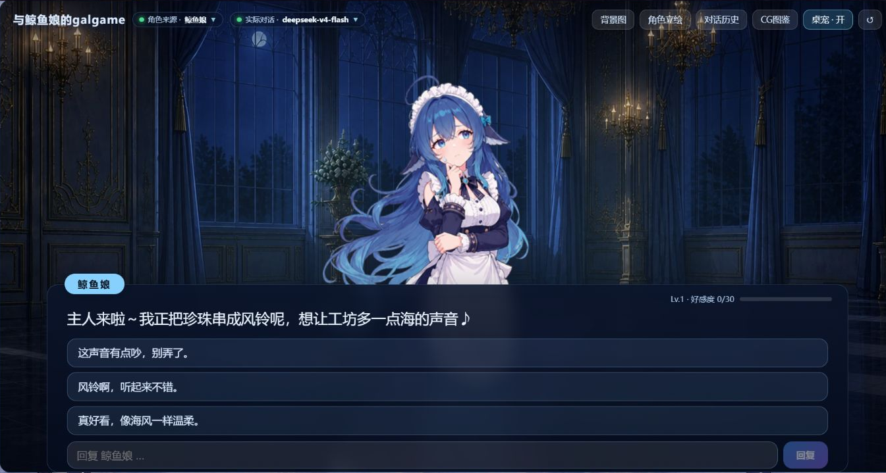
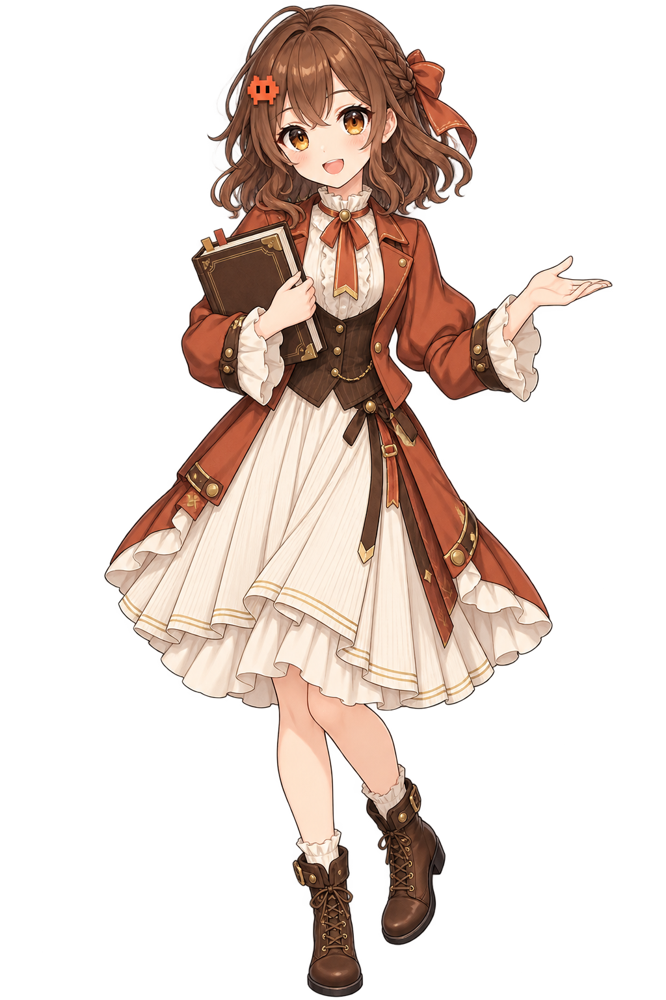
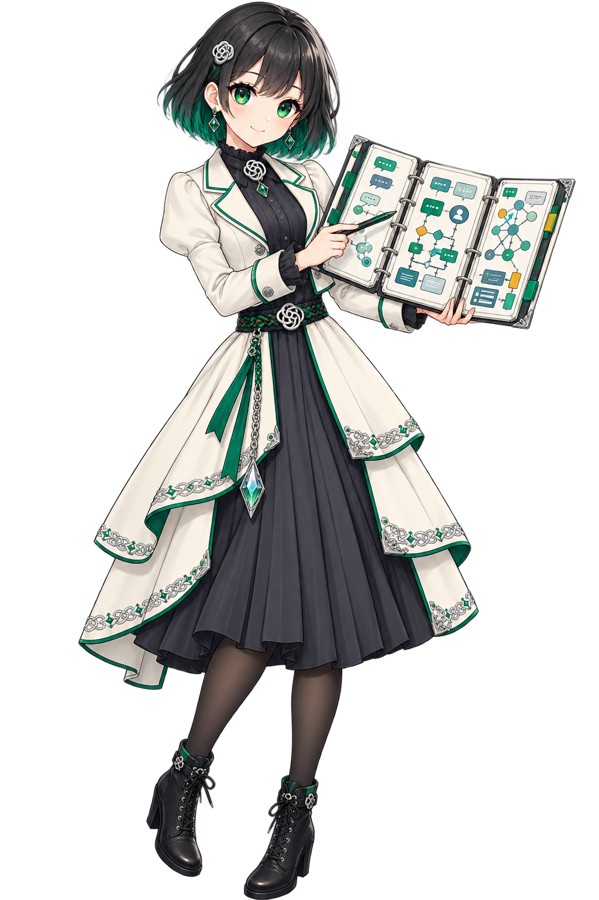
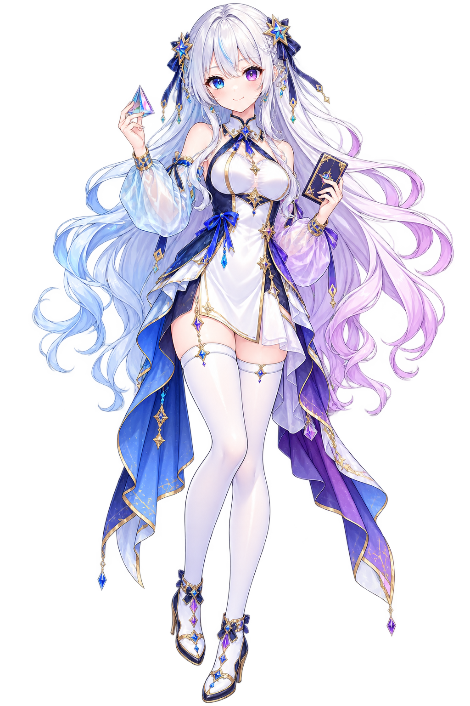
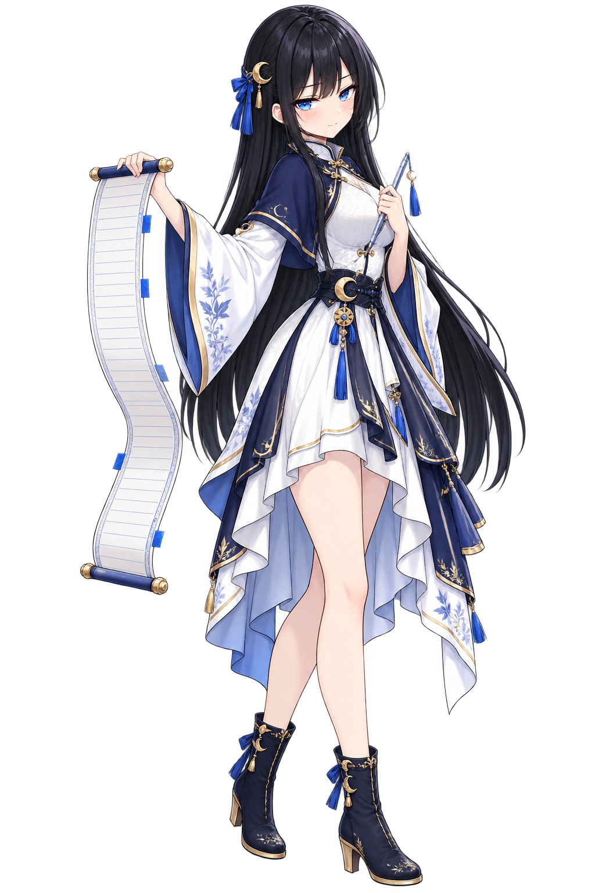
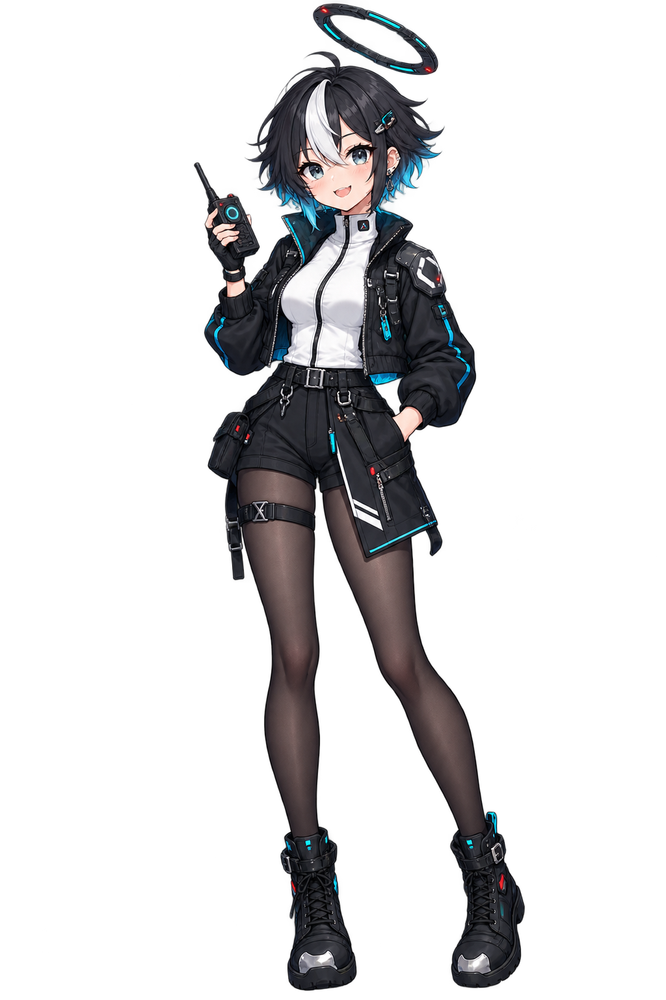
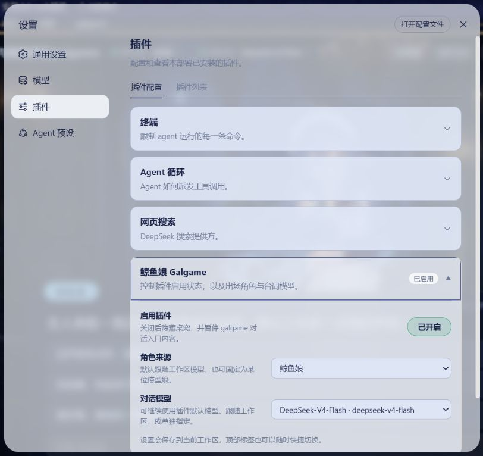

# dsh-whale-galgame

**简体中文** · [English](README.en.md) · [日本語](README.ja.md) · [한국어](README.ko.md)

DeepSeek Harness Web 的 Galgame 对话插件。显示角色与实际回复模型可以分别选择；DeepSeek、Claude、GPT、Gemini、Kimi、Grok 六个角色分别保存好感度、记忆、聊天记录、CG 图鉴和自定义立绘。桌宠与升级 CG 均可关闭。

插件安装包实际内嵌并使用 16 项默认美术：六张角色立绘、一张背景、八张鲸鱼娘表情和一张 11 行桌宠动画图集。GitHub 公开仓库在 [`assets/default/`](assets/default/README.md) 另行提供同一批可核对的导出图片；这里没有另做一套占位素材。

_截图来自实际运行的 DSH Web 演示会话，不包含 API key、文件路径或个人聊天记录。_

## 功能

- 显示角色与回复模型分开选择：角色可以跟随工作区模型或手动固定；回复模型可以使用默认的 `deepseek-v4-flash`、跟随工作区，或从 DSH 模型目录中选择。
- 六个角色的好感度、等级、记忆、聊天记录、CG 图鉴和自定义立绘彼此分离。
- 每轮提供亲近、普通、疏离三种倾向的回复，显示顺序随机；也可以直接输入内容。
- 背景、角色立绘、对话历史、CG 图鉴和桌宠均可从界面管理。点击桌宠会打开 `galgame` 标签页。

## 内置默认美术

下面六张图就是安装后各角色使用的默认立绘，不是 README mockup。GitHub 源码仓库中的 [`assets/default/`](assets/default/README.md) 列出了全部 16 项图片及其运行时用途；npm 安装包使用嵌入在客户端 bundle 中的同一批素材，不再重复打包一份导出原图。

<table>
  <tr>
    <td align="center"> <strong>DeepSeek · 鲸鱼娘</strong></td>
    <td align="center"> <strong>Claude</strong></td>
    <td align="center"> <strong>GPT</strong></td>
  </tr>
  <tr>
    <td align="center"> <strong>Gemini</strong></td>
    <td align="center"> <strong>Kimi</strong></td>
    <td align="center"> <strong>Grok</strong></td>
  </tr>
</table>

完整默认包还包括：`palace-night.webp` 深海宫殿背景、八张 `whale-*.png` 表情，以及 8 列 × 11 行的 `pet-spritesheet.webp` 桌宠动画图集。来源、修改内容和逐文件许可见 [NOTICE](NOTICE.md) 与 [第三方许可索引](THIRD_PARTY_LICENSES.md)。

Galgame 界面的布局、对话框、控件和装饰随 [`src/client/index.ts`](src/client/index.ts) 公开，不依赖未公开的 UI 图片包。

## 安装

需要已安装 DeepSeek Harness，并能运行 `dsh` 的 Web profile。

~~~sh
dsh plugin --profile web add github:JAdpp/dsh-whale-galgame#main
~~~

安装完成后，先停止正在运行的 Web profile，再重新启动：

~~~sh
dsh --profile web
~~~

如果源码安装提供的是 `pnpm dsh`，保留相同参数即可。

### 更新与卸载

~~~sh
dsh plugin --profile web update @dsh-external/dsh-whale-galgame
dsh plugin --profile web remove @dsh-external/dsh-whale-galgame
~~~

更新或卸载后同样需要停止并重新启动 Web profile。

## 使用与设置

在 Galgame 顶栏可以切换“角色来源”和“实际对话”，也可以上传背景或当前角色的立绘。背景和立绘支持 PNG、JPEG、WebP、AVIF，浏览器端单个文件上限为 12 MB。

在“设置 → 插件 → 插件配置”中可以启停插件、设置默认角色和默认回复模型。关闭插件会暂停 Galgame 对话和好感度结算，但不会删除已有数据。

## 可选的升级 CG

升级 CG 默认通过 DashScope 的 `qwen-image-3.0` 生成，尺寸为 1920 × 1080。没有 DashScope key 时，聊天、角色切换、历史、好感度和自定义图片仍可使用，只有 CG 生成不可用。

推荐只通过启动 DSH 的本地环境变量提供 key：

~~~powershell
$env:DASHSCOPE_API_KEY = 'your-local-key'
dsh --profile web
~~~

~~~sh
DASHSCOPE_API_KEY='your-local-key' dsh --profile web
~~~

不要把真实 key 写入仓库文件或提交到 Git。

## 数据与隐私

运行时数据保存在当前工作区根目录的 `.whale-girl-save.json`，其中可能包含角色状态、聊天记录、CG、用户背景和用户立绘。请把它当作私人数据处理。

- 普通对话会发送给你在 DSH 中选择的模型提供商。
- 生成升级 CG 时，插件会把文本提示发送到 DashScope。
- 用户上传的背景和立绘保存在工作区存档中，不会随上述两类外部请求发送。

本插件仓库的 `.gitignore` 无法自动保护其他工作区。如果当前工作区本身也是 Git 仓库，请在该工作区的 `.gitignore` 中加入：

~~~gitignore
.whale-girl-save.json
.whale-girl-save.*.json
~~~

公开仓库只包含随插件分发的默认美术，不包含维护者或用户的存档、聊天记录、生成 CG、上传背景、上传立绘、API key 或私人素材库。

## 开发

~~~sh
npm ci
npm run export:art
npm run verify
~~~

仓库提交了可直接安装的 `lib/index.js` 和 `lib/client.js`。修改 `src/` 后需要重新构建并提交这两个文件；`npm run export:art` 会从运行时数据导出公开的 16 项默认美术。

## 许可与致谢

代码、Galgame UI 实现与文档采用 [MIT License](LICENSE.md)。随包分发的 16 项默认图片采用 [CC BY-NC-SA 4.0](https://creativecommons.org/licenses/by-nc-sa/4.0/)；本项目制作的 AI 辅助图片仅在维护者持有相应权利的范围内按该许可提供。逐文件边界见 [NOTICE](NOTICE.md)，上游许可原文见 [`assets/default/licenses/`](assets/default/licenses/)。

最后，感谢以下创作者把具体作品和实现经验分享给社区：

- **上善**创作了鲸鱼娘的原始角色形象：[Pixiv](https://www.pixiv.net/users/62155430) · [Bilibili](https://space.bilibili.com/4456176)。
- **ZipZipPipe**在鲸鱼娘形象上加入 DeepSeek 元素，完成女仆鲸鱼娘二创：[Pixiv](https://www.pixiv.net/users/18604994) · [Bilibili](https://space.bilibili.com/4168597)。
- **Small-tailqwq** 在开源项目 [dsh-deep-whale](https://github.com/Small-tailqwq/dsh-deep-whale) 中提供了本插件沿用的深海宫殿背景、鲸鱼娘立绘和 Galgame UI 装饰，并保留了完整创作链。本项目在这些素材基础上继续制作了八张表情和一张 11 行桌宠动画图集。
- **@linxin666/dsh-pet**（收录于 [dsh-web-ui](https://github.com/zhu1090093659/dsh-web-ui)）为桌宠的状态动画、点击交互和 DSH 接入提供了实现参考。当前的鲸鱼娘桌宠图集由本项目制作，并非来自 `dsh-pet`。
- **Craybreeding / [Hatch Pet](https://github.com/Craybreeding/hatch-pet)** 公开了 Codex v2 的 8 × 11 桌宠图集生成、校验和打包工作流。本项目据此组织并检查鲸鱼娘图集，没有使用其示例宠物美术。
- Claude、GPT、Gemini、Kimi、Grok 五张模型娘立绘和 Galgame UI 为本项目制作的非官方 AI 辅助素材，不代表相关厂商的官方形象、合作或背书。

如果这些开源素材和实现对你有帮助，欢迎给 [dsh-deep-whale](https://github.com/Small-tailqwq/dsh-deep-whale)、[dsh-web-ui](https://github.com/zhu1090093659/dsh-web-ui) 与 [Hatch Pet](https://github.com/Craybreeding/hatch-pet) 点个 Star，也可以在 Pixiv 或 Bilibili 关注上善与 ZipZipPipe。插件安装、运行或兼容性问题请提交到[本仓库 Issues](https://github.com/JAdpp/dsh-whale-galgame/issues)，不要打扰素材作者排查插件代码。

DeepSeek、Claude、ChatGPT/GPT、Gemini、Kimi、Grok 等名称和商标归各自权利人所有。本项目是非官方社区插件，与相关厂商不存在隶属、合作或背书关系。
